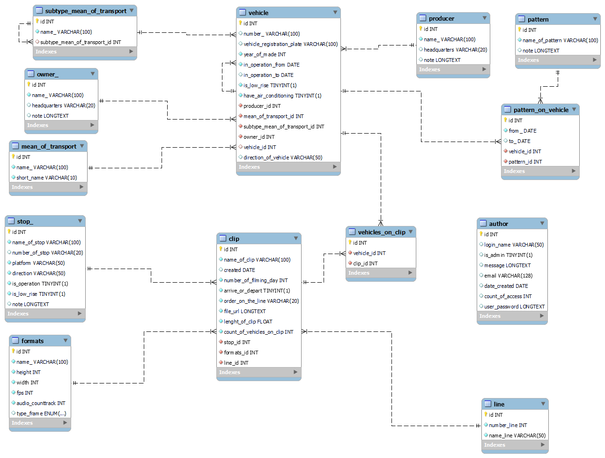

# Evidence záběrů o MHD - schéma databáze pro MySQL server

# účel
Schéma databáze pro program Evidence záběrů o MHD

# schéma databáze



##  pohledy (view) v databázi

- `info_from_clip_for_filter` - slouží k výpisů záznamu do filtru.
jedná se o spojení tabulky clip s tabulkami: line, stop_, vehicle_, subtype_mean_of_transport, mean_of_transport, producer, owner_,
formats
a vypisuje tyto atributy: id, name_of_clip, created, number_of_filming_day, file_url, arrive_or_depart, name_line, name_of_stop, platform,
direction, number_of_vehicle, subtype_mean_of_transport.name_, mean_of_transport.name_, producer.name_,owner_.name_ , format_

- `info_from_clip_match_vehicles_II` - slouží k výpisu záznamu v tabulce clip
jedná se o spojení tabulky clip s tabulkami: line, stop_, vehicle_, formats
a vypisuje tyto atributy: id, name_of_clip, created, number_of_filming_day, arrive_or_depart, name_line, name_of_stop, platform,
direction, number_of_vehicle, order_of_vehicle, format_

- `show_vehicles` – slouží k výpisu záznamu v tabulce vehicle
jedná se o spojení tabulek: vehicle s tabulkami: producer, owner_, mean_of_transport, subtype_mean_of_transport, predecessor (selfreference)
a vypisuje tyto atributy: id, number_, vehicle_registration_plate,year_of_made, in_operation_from, in_operation_to, is_low_rise,
have_air_conditioning, producer.name_, mean_of_tranposrt.name_, subtype_mean_of_transport.name_, owner_.name_,
predecessor.number_
 
- `info_from_clip_match_vehicles` - předchůdce - `info_from_clip_match_vehicles_II`

## procedury (stored procedure) v databázi

- `overview (year_ varchar(14))` - kompletní přehled

- `recalculation_clips_on_days (year_ varchar(14))` - 
zobrazuje počet natočených záběrů na jednotlivý den

- `recalculation_clips_on_month (year_ varchar(14))` - 
zobrazuje počet natočených záběrů na jednotlivý měsíc

- `recalculation_clip_on_line (year_ varchar(14))` -
zobrazuje kolikrát jsem danou linku natočil

- `recalculation_clip_to_stops (year_ varchar(14))` -
zobrazuje kolik záběrů bylo pořízeno na konkrétní zastávce

- `recalculation_days_on_stop (year_ varchar(14))` -
zobrazuje kolik natáčecích dnů jsem byl na konkrétní zastávce

- `recalculation_on_subtype_mean_of_transport_from_clip (year_ varchar(14))` - 
zobrazuje kolikrát byl natočen daný podtyp dopravního prostředku

- `recalculation_lines_on_stop_from_clip (year_ varchar(14))` - 
zobrazuje počet natočených linek na zastávku

- `recalculation_subtypes_mean_of_transport_on_lines_from_clip (year_ varchar(14))` -
zobrazuje kolikrát byl natočen daný podtyp dopravního prostředku na konkrétní lince

tyto procedury fungují tak, že 


## funkce (functions) v databázi
- `count_of_vehicles_on_clip (clip__id int) RETURNS int`
```
begin
    declare return_parametr int;
    select count(*) into return_parametr from vehicles_on_clip where clip_id = clip__id;
    return return_parametr;

end
```

## nastavení integritních omezení (CHECK)

|název konstanty|omezení|
|-|-|
|author_chk_1|	(`email` like _utf8mb4\'%@%\')|
|author_chk_2|	(`count_of_access` >= -(1))|
|clip_chk_1	|(`lenght_of_clip` >= 0)|
|formats_chk_1	|(`height` > 1)|
|formats_chk_2	|(`width` > 1)|
|formats_chk_3|	(`fps` >= 0)|
|formats_chk_4|	(`audio_counttrack` >= 0)|

# další odkazy:

[Desktop aplikace v C#](https://github.com/Martin-Hamacek-05/evidence_clip_about_public-transport)

[Webová "aplikace" v PHP](https://github.com/Martin-Hamacek-05/web_app_ev_clip_about_p_transport)
